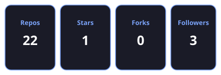
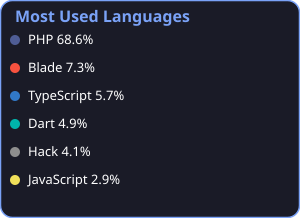
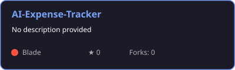
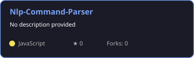

<div align="center">

# 👋 Hello, I'm SUPER_POKE


<br>


</div>

---

# 🚀 About Me

```yaml
Name          : Herman Taufiq
Username      : hermantaufiq
Role          : Full Stack Web Developer
Education     : Information Technology Student
Country       : Indonesia 🇮🇩

Current Focus :
  - Laravel 13
  - PHP Development
  - Artificial Intelligence
  - Modern Web Application
  - UI/UX Design

Currently Learning :
  - Docker
  - REST API
  - Deployment
  - Clean Architecture
```

---

# 💻 Tech Stack

## 🌐 Frontend

<p align="left">

</p>

---

## ⚙️ Backend

<p align="left">

</p>

---

## 🗄 Database

<p align="left">

</p>

---

## 🛠 Tools

<p align="left">

</p>

---

# 📚 Currently Studying

<p>


</p>

---

# 🌱 What I'm Doing

- 🚀 Building Full Stack Laravel Applications
- 🤖 Learning Artificial Intelligence
- 📱 Developing Responsive Web Applications
- 📚 Studying Software Engineering
- 💡 Exploring New Technologies Every Day

---

# 🎯 2026 Roadmap

| Goal | Status |
|------|--------|
| Master Laravel 13 | 🔄 In Progress |
| Build AI Projects | 🔄 In Progress |
| Learn Docker | ⏳ Planned |
| Deploy Real Projects | ⏳ Planned |
| Graduate with Best Thesis | 🎯 Target |

---

# 💬 Favorite Quote

> **"Code. Learn. Improve. Repeat."**

---

<div align="center">

### ⭐ Thanks for Visiting My Profile ⭐

</div>

---


# 📊 GitHub Analytics
<div align="center">


</div>

---

# 🔥 GitHub Streak

<div align="center">


</div>

---

# 📈 Contribution Graph

<div align="center">


</div>

---

# 🏆 GitHub Trophy

<div align="center">


</div>

---

# 💡 Developer Metrics

<div align="center">


</div>

---

# ⚡ Coding Activity

```text
Laravel        ████████████████████ 90%

PHP            ██████████████████░░ 85%

JavaScript     ███████████████░░░░░ 70%

MySQL          █████████████████░░░ 80%

HTML/CSS       ███████████████████░ 88%

AI             ████████████░░░░░░░░ 60%
```

---

# 📅 Weekly Development Breakdown

```text
Monday      ████████████░░░░░ 6 hrs

Tuesday     █████████████░░░░ 7 hrs

Wednesday   ██████████░░░░░░░ 5 hrs

Thursday    ███████████████░░ 8 hrs

Friday      █████████████░░░░ 7 hrs

Saturday    ████████████████░ 9 hrs

Sunday      ████████░░░░░░░░░ 4 hrs
```

---

# 🚀 Development Focus

| Category | Progress |
|----------|---------:|
| Laravel Development | ██████████ 95% |
| Backend API | █████████ 90% |
| Database Design | ████████ 85% |
| Frontend Development | ████████ 80% |
| Artificial Intelligence | ██████ 60% |
| Docker & Deployment | ████ 40% |

---

# 🎖 Achievements

- 🥇 Full Stack Web Development
- 🚀 Laravel 13 Projects
- 🤖 AI Enthusiast
- 💻 Open Source Learner
- 🌱 Continuous Learning
- 📚 Information Technology Student

---

<div align="center">

### 📈 Keep Coding • Keep Learning • Keep Growing 🚀

</div>

--- 

# 🚀 Featured Projects

<div align="center">

| Project | Description | Tech Stack |
|---------|-------------|------------|
| 💰 **AI Expense Tracker** | Smart expense management with AI category prediction | Laravel 13 • PHP • MySQL |
| 🏡 **Smart Village Monitoring** | Village monitoring and information management system | Laravel • Bootstrap • MySQL |
| 🌾 **Basmati Rice Website** | Company profile & SEO landing page | Laravel • Tailwind CSS |
| 🌐 **Personal Portfolio** | Personal portfolio website | Laravel • JavaScript |

</div>

---

# 📌 Pinned Repositories
<div align="center">
<a href="https://github.com/hermantaufiq/AI-Expense-Tracker"></a>
<a href="https://github.com/hermantaufiq/Kostpro"></a>
<a href="https://github.com/hermantaufiq/Tugas-Sig"></a>
<a href="https://github.com/hermantaufiq/Nlp-Command-Parser"></a>
</div>

---

# 💼 What I Can Build

✅ Company Profile Website

✅ Landing Page

✅ Dashboard Admin

✅ CRUD Application

✅ Authentication System

✅ REST API

✅ AI-Based Web Application

✅ Responsive Website

✅ Database Design

✅ Deployment (Learning)

---

# 🛠 Development Workflow

```text
Idea
   │
   ▼
Research
   │
   ▼
UI / UX Design
   │
   ▼
Database Design
   │
   ▼
Laravel Development
   │
   ▼
Testing
   │
   ▼
Deployment
```

---

# 📖 Currently Reading

- 📘 Laravel Documentation
- 📘 PHP Official Documentation
- 📘 Clean Code
- 📘 Software Engineering
- 📘 Artificial Intelligence
- 📘 REST API Design

---

# 🎓 Certifications (Coming Soon)

🏅 Laravel

🏅 PHP

🏅 JavaScript

🏅 MySQL

🏅 Docker

🏅 AI

---

# 📫 Connect With Me

<div align="center">

<a href="https://github.com/hermantaufiq">

</a>

<a href="mailto:your-email@gmail.com">

</a>

<a href="https://www.linkedin.com/in/your-linkedin">

</a>

<a href="https://www.instagram.com/gateway_502">

</a>

</div>

---

# ❤️ Support

If you like my work, consider giving ⭐ to my repositories.

Every ⭐ motivates me to build more useful open-source projects.

---

<div align="center">

## 🌟 Thanks for visiting my GitHub Profile!


</div>

---

# 🐍 Contribution Snake

<div align="center">

<picture>
  <source
    media="(prefers-color-scheme: dark)"
    srcset="https://raw.githubusercontent.com/hermantaufiq/hermantaufiq/output/github-contribution-grid-snake-dark.svg"
  />
  <source
    media="(prefers-color-scheme: light)"
    srcset="https://raw.githubusercontent.com/hermantaufiq/hermantaufiq/output/github-contribution-grid-snake.svg"
  />
  
</picture>

</div>

---

# 📅 2026 Goals

| Goal | Progress |
|------|----------|
| 🚀 Master Laravel 13 | ████████░░ 80% |
| 🤖 Learn Artificial Intelligence | ██████░░░░ 60% |
| 🐳 Learn Docker | ████░░░░░░ 40% |
| ☁️ Deploy Full Stack Project | ███░░░░░░░ 30% |
| 🎓 Graduate Successfully | ███████░░░ 70% |
| 💼 Get Professional Job | █████░░░░░ 50% |

---

# 🎯 My Development Principles

<div align="center">

💡 Learn Every Day

🚀 Build Real Projects

📚 Never Stop Improving

🤝 Share Knowledge

🌍 Contribute to Open Source

</div>

---

# 📊 Profile Summary

```text
👨‍💻 Full Stack Developer

⚡ Laravel Enthusiast

🤖 AI Explorer

📚 Information Technology Student

🇮🇩 Indonesia
```

---

# 💬 Random Developer Quote

> "First, solve the problem. Then, write the code."

---

# 🎮 Fun Facts

- ☕ Coffee makes coding more enjoyable.
- 🌙 I enjoy coding at night.
- 📚 I learn something new every day.
- 🚀 I like building useful web applications.
- 💡 Clean code is better than clever code.

---

# 🌟 Thank You

<div align="center">

## ⭐ Thank you for visiting my GitHub profile!

If you like my projects, don't forget to leave a ⭐.

<br>


</div>
